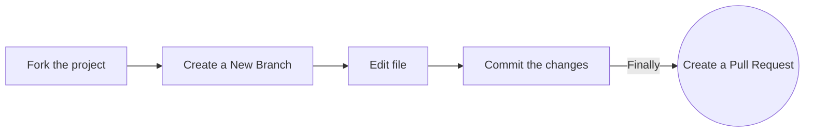

# Hacktober Fest 2023⚡️✨
This repository is about collecting different important DSA topics/questions that are mostly asked in placement. Start your journey to the world of open source and participate in Hacktoberfest 2023.

## Steps to follow :scroll:

### Tips: Complete this process in GitHub (in your browser)

